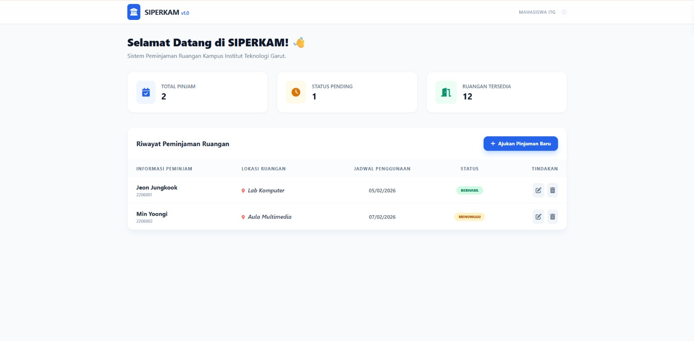
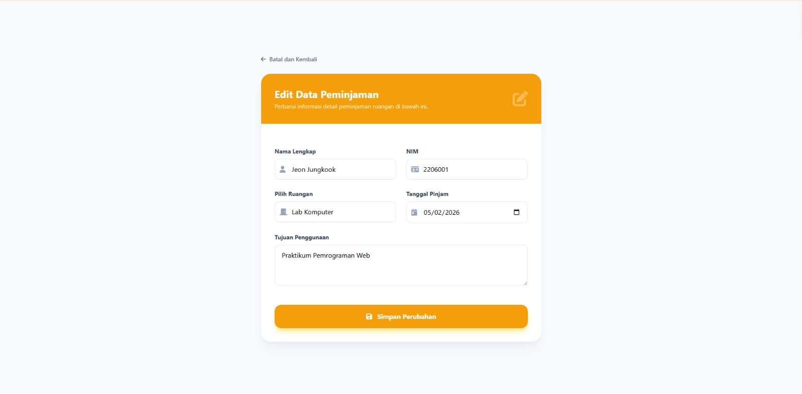

# SIPERKAM  
### Sistem Peminjaman Ruangan Kampus ITG

---

## a. Nama Website
**SIPERKAM (Sistem Peminjaman Ruangan Kampus ITG)**

---

## b. Teknologi yang Digunakan
Website ini dibangun menggunakan teknologi berikut:

- **Backend Framework:** Laravel 12  
- **Bahasa Pemrograman:** PHP 8.2  
- **Database:** MySQL  
- **Frontend:** Blade Templating Engine  
- **UI Framework:** Bootstrap 5  
- **Authentication:** Laravel Authentication (Login & Register)  
- **Version Control:** Git & GitHub  
- **Web Server (Local):** Laravel Artisan Serve  

---

## c. Deskripsi & Tujuan Website
SIPERKAM adalah aplikasi berbasis web yang dirancang untuk membantu proses **peminjaman ruangan kampus Institut Teknologi Garut (ITG)** secara terstruktur, efisien, dan terdokumentasi dengan baik.

Tujuan pembuatan website ini adalah:
- Mempermudah mahasiswa atau civitas akademika dalam mengajukan peminjaman ruangan
- Mengurangi proses manual (pencatatan berbasis kertas)
- Menyediakan sistem CRUD (Create, Read, Update, Delete)
- Mengimplementasikan konsep **MVC (Model–View–Controller)** menggunakan framework Laravel
- Memenuhi tugas mata kuliah **Pemrograman Web Berbasis Framework**

---

## d. Nama Kelompok
**Kelompok SIPERKAM**

---

## e. Anggota Kelompok
1. **Meitha Amanda**  
   NIM: 2307005  

2. **Ai Sena Marlina**  
   NIM: 2307017  

3. **Ai Hilma Khoiriyah**  
   NIM: 2307022  

---

## Fitur Utama Sistem
- Login & Logout User
- Manajemen Peminjaman Ruangan (CRUD)
- Validasi Form Input
- Integrasi Database MySQL
- Tampilan UI responsif dan user-friendly

---

## Cara Menjalankan Project
1. Clone repository:
   ```bash
   git clone https://github.com/MeithaAmanda/k1-siperkam.git
````

2. Masuk ke folder project:

   ```bash
   cd k1-siperkam
   ```

3. Install dependency:

   ```bash
   composer install
   ```

4. Copy file environment:

   ```bash
   cp .env.example .env
   ```

5. Generate application key:

   ```bash
   php artisan key:generate
   ```

6. Konfigurasi database pada file `.env`

7. Jalankan migrasi database:

   ```bash
   php artisan migrate
   ```

8. Jalankan server:

   ```bash
   php artisan serve
   ```

9. Akses aplikasi melalui browser:

   ```
   http://127.0.0.1:8000
   ```

---
## Dokumentasi Tampilan Sistem


### 1. Dashboard / Halaman Utama
Menampilkan daftar peminjaman ruangan yang telah diajukan oleh pengguna.



---

### 2. Form Peminjaman Ruangan
Digunakan oleh pengguna untuk mengajukan peminjaman ruangan kampus.


---

### 3. Halaman Edit Peminjaman
Digunakan untuk mengubah data peminjaman ruangan yang sudah diajukan.



